

# Twitter clone

Twitter clone developed using Spring Boot and React.js.  
The project is always updated with new features.  
See more demo screenshots below.

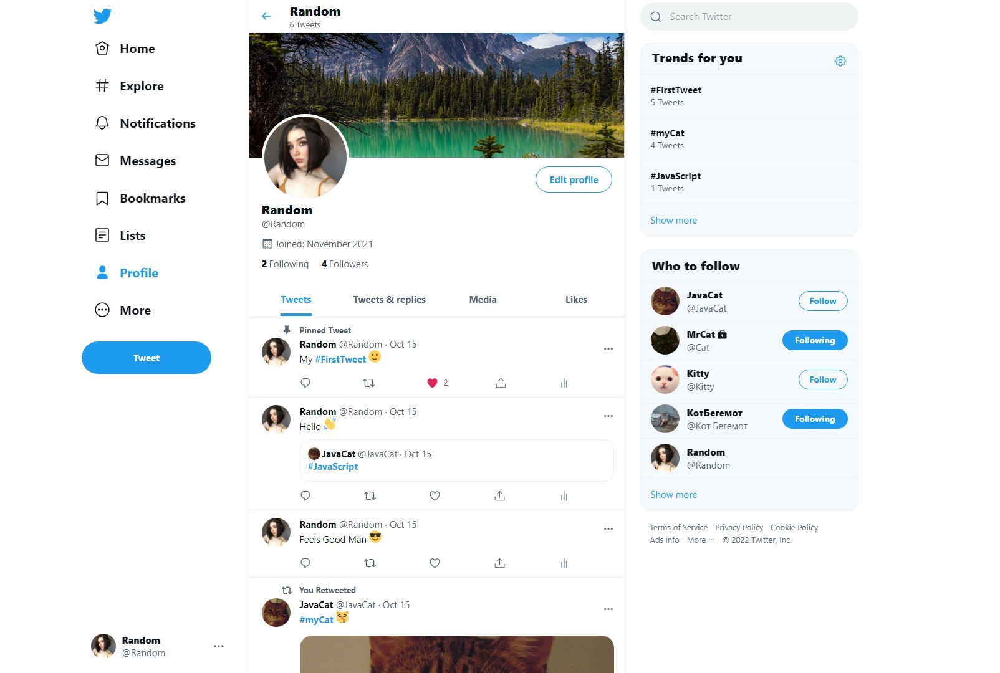

## Used Technologies:

* Back-end: Java, Spring (Boot, Data, Security), JPA / Hibernate, PostgreSQL, JUnit, Mockito
* Front-end: TypeScript, React.js, Redux-Saga, Material-UI
* Security: JWT
* AWS S3 bucket

## Features

* Authentication with JWT and Email validation. Password change.
* Users can Add tweets, Like, Retweet, Reply, Quote tweets, Schedule tweets.
* Users can Delete tweets, Send tweet via Direct Message, Add tweet to Bookmarks.
* Users can Create Lists, Edit Lists, Add other users to Lists, Follow List, Pin Lists.
* Users get notifications when someone subscribed, retweet or liked tweet.
* Users can add Images to tweet, Create Poll and vote, Post tweets with link preview, Posts tweets with YouTube video link.
* Websocket online chats.
* Private user profile and lists.
* Account Settings.
* Users can subscribe to each other.
* User can edit profile.
* User can block and mute other users.
* Users can customize site color scheme and color background.
* Users can search tweets by hashtags and search other users and users tweets.
* All images downloads on Amazon S3 bucket.

## Next Updates

* Advanced search
* Queries optimization
* Front-end testing
* Front-end refactoring
* Adaptive layout

## Installation

1. Install maven: [link](https://www.baeldung.com/install-maven-on-windows-linux-mac)
2. Install Java: [link](https://www.oracle.com/java/technologies/javase/jdk15-archive-downloads.html)
3. Install Postgresql: [link](https://www.postgresql.org/download/)
4. Install Intellij IDEA Ultimate: [link](https://www.jetbrains.com/idea/)
5. Open pgAdmin and create a new DB (name: twitter and twittertest) in Postgresql: [link](https://www.guru99.com/postgresql-create-database.html#:~:text=PostgreSQL%20Create%20Database%20using%20pgAdmin)
6. Add Lombok plugin to the Intellij IDEA: [link](https://i.ibb.co/Gtwcw0t/6-lombok.jpg)
7. Configure project like: [link](https://i.ibb.co/HxzkCvj/7-configuration.jpg)
8. Add Postgresql properties to the application.properties file: [link](https://i.ibb.co/tLnnCLZ/8-postgres.jpg)
9. Register new AWS account: [link](https://portal.aws.amazon.com/billing/signup#/start)
10. Create new S3 bucket: [link](https://docs.aws.amazon.com/AmazonS3/latest/userguide/create-bucket-overview.html)
11. Change access from private to public in S3 bucket
12. Add public access policy to S3 bucket (!!!important!!! see:
[doc](https://docs.aws.amazon.com/AmazonS3/latest/userguide/access-policy-language-overview.html),
[github examle](https://stackoverflow.com/questions/58580042/how-to-set-public-read-only-access-on-amazon-s3-bucket#:~:text=To%20make%20objects%20publicly%20accessible%2C%20use%20a%20policy%20like%20this%3A) or 
[my example](https://i.ibb.co/mSpHmyL/12-bucket.jpg))
13. Get AWS keys: [link](https://supsystic.com/documentation/id-secret-access-key-amazon-s3/) and add to the application.properties file: [link](https://i.ibb.co/zHw537K/13-key.jpg)
14. Register in gmail
15. Create google API keys: [link](https://developers.google.com/youtube/v3/getting-started#before-you-start)
16. Add google API key to the application.properties file: [link](https://i.ibb.co/3fgJc8V/16-google-api.jpg)
17. Add gmail account and password to the application.properties file: [link](https://i.ibb.co/Sc3QZZr/17-gmail.jpg)
18. Go to [link](https://myaccount.google.com/u/2/lesssecureapps) (important) and change to: “Allow less secure apps: ON”
19. Install node.js and npm: [link](https://docs.npmjs.com/downloading-and-installing-node-js-and-npm)
20. Open terminal in client directory and type: npm install (or yarn install)
21. Now you can run TwitterApplication (port 8080) and open terminal in client directory and type: npm start
22. Navigate to http://localhost:3000/home

#### To enter the application you can register or login:
Login: user2016@gmail.com  
Password: qwerty

## Screenshots

#### Add tweet
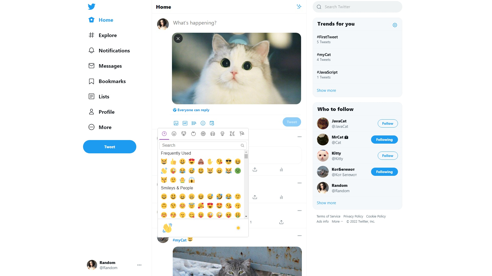
___
#### Add Poll
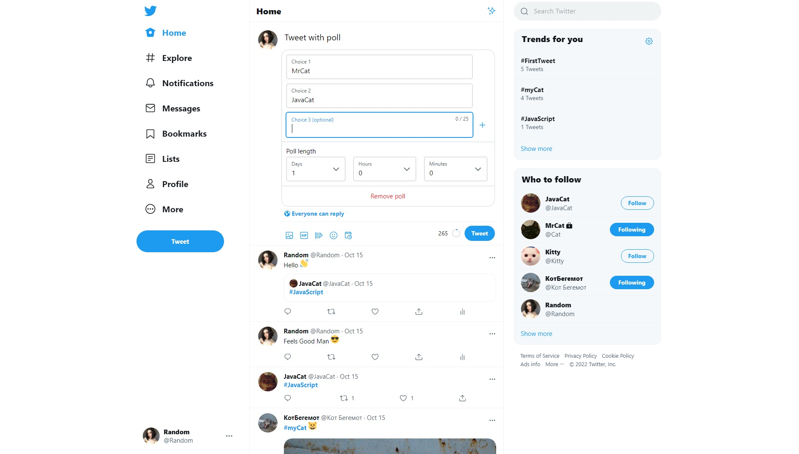
___
#### Reply tweet
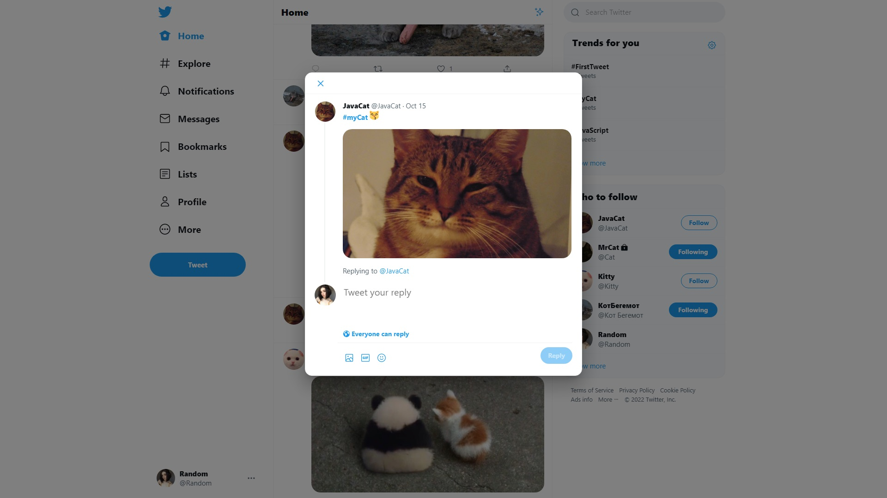
___
#### Tweet image modal
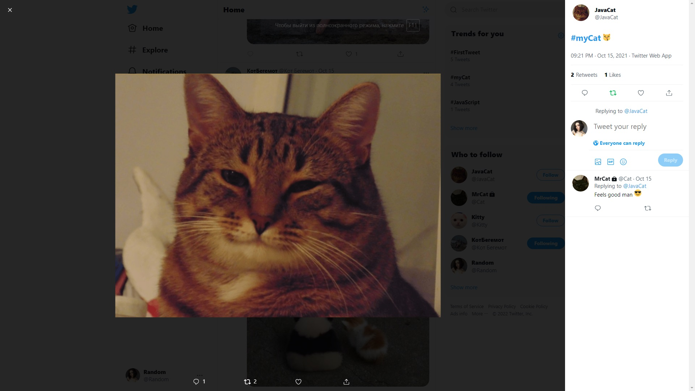
___
#### Notifications
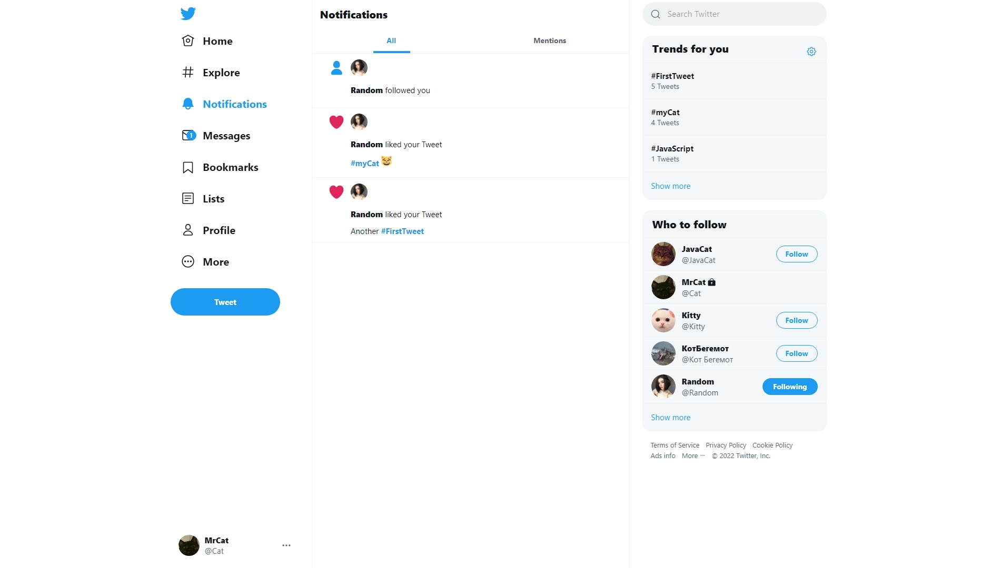
___
#### Full Notifications

___
#### Search
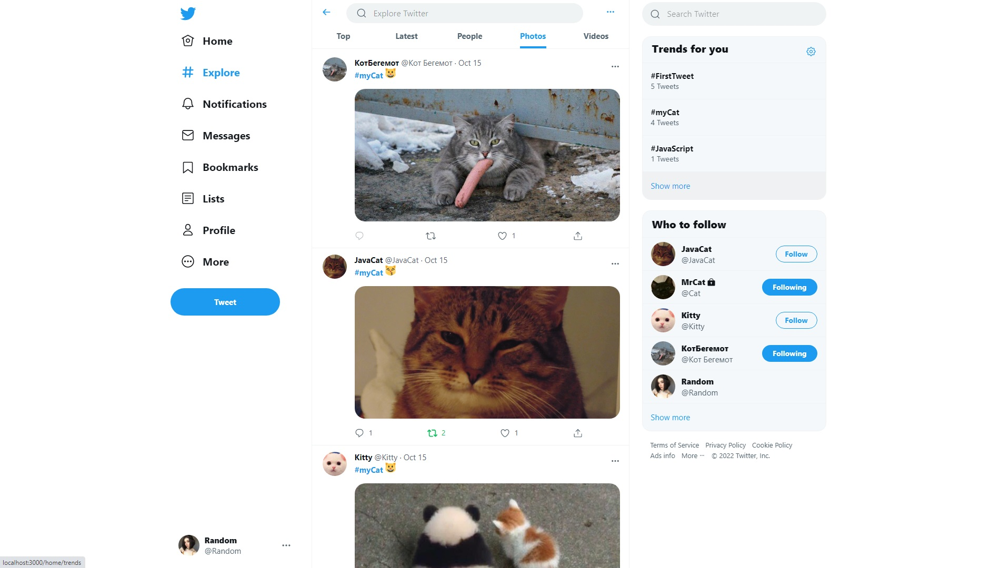
___
#### Search Videos
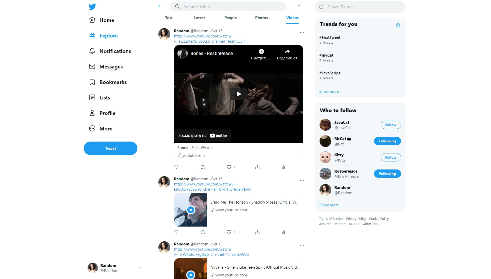
___
#### Full tweet
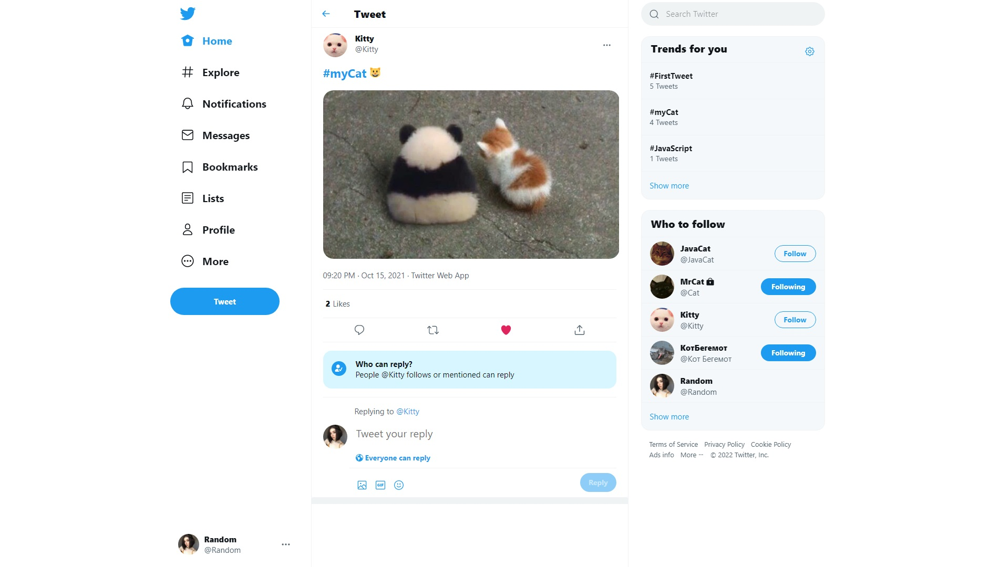
___
#### Liked by Modal window

___
#### Following and Followers
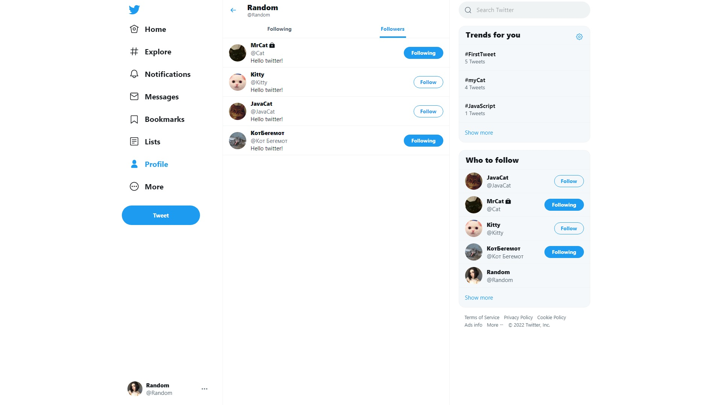
___
#### Trends
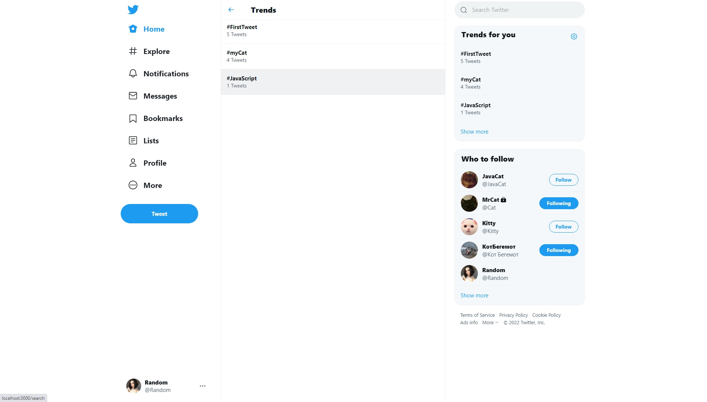
___
#### Bookmarks
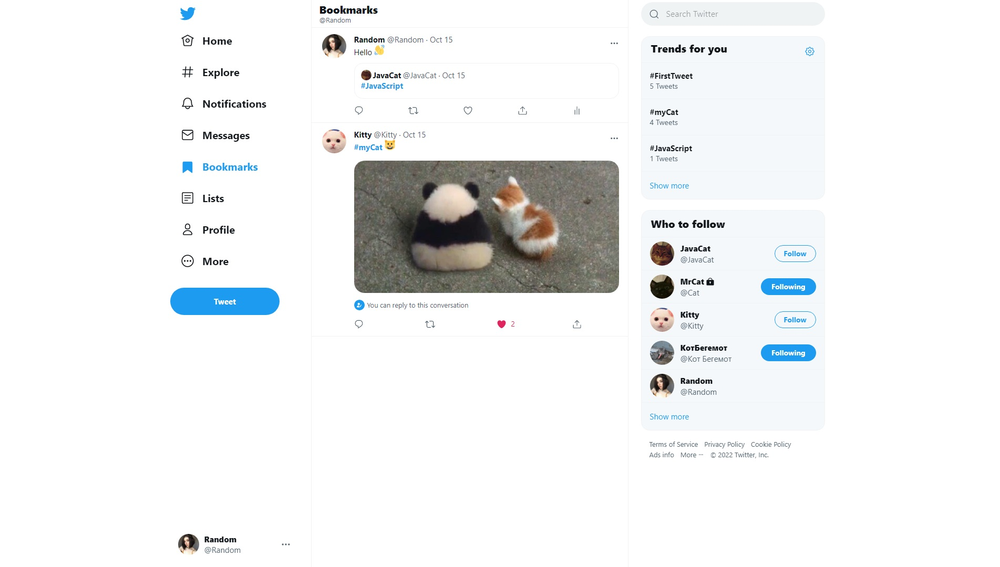
___
#### Chat
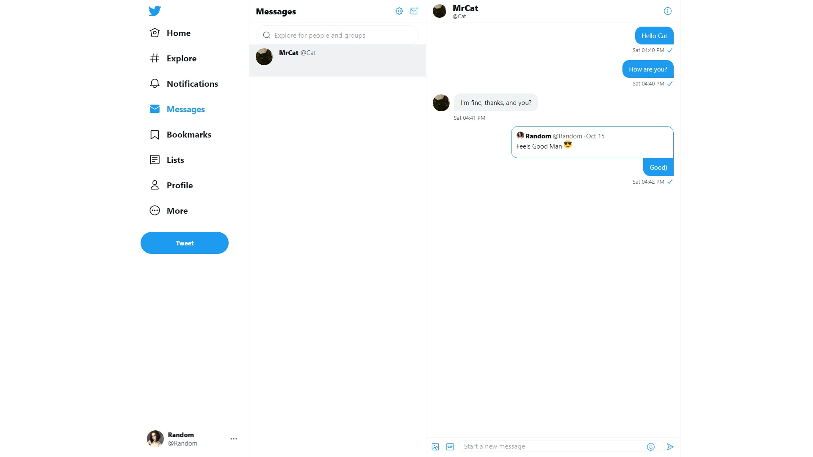
___
#### Lists
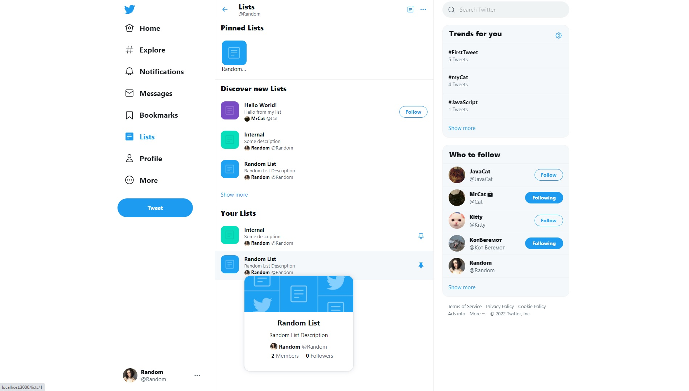
___
#### Full List

___
#### Suggested Lists
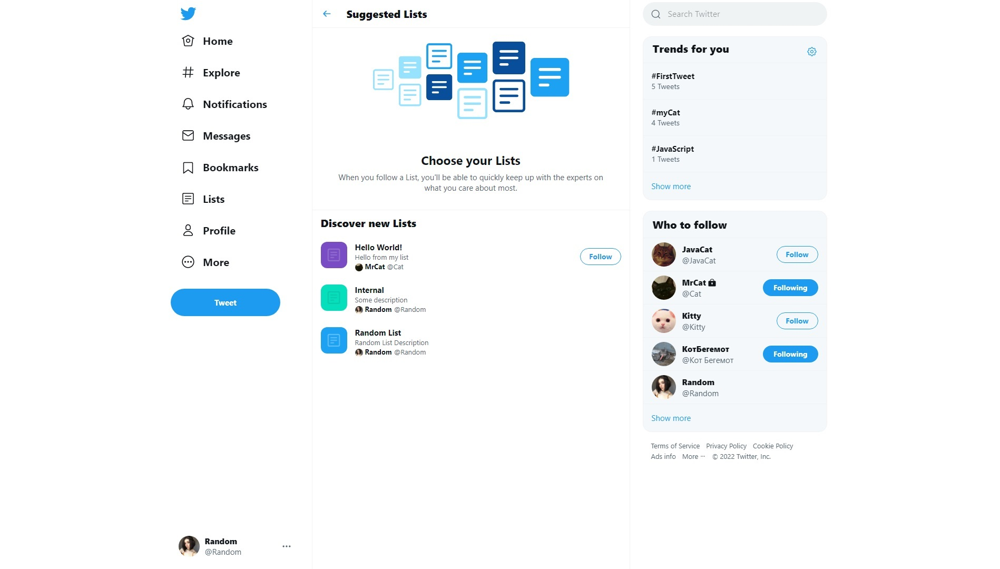
___
#### Settings

___
#### Customization
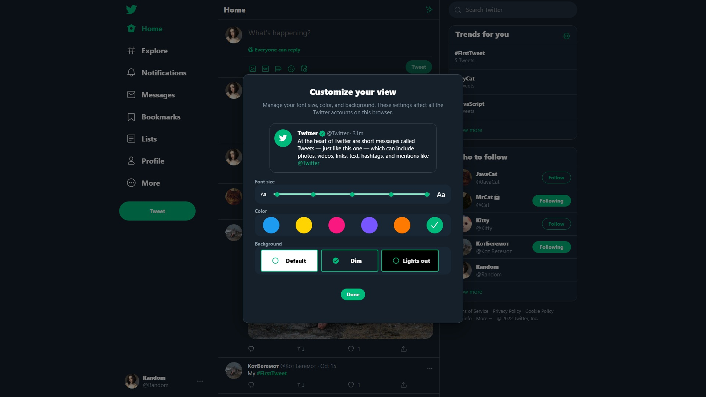
___
#### Dark theme profile
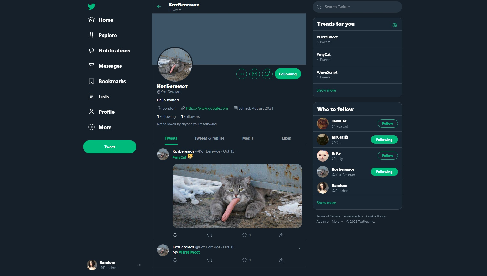
