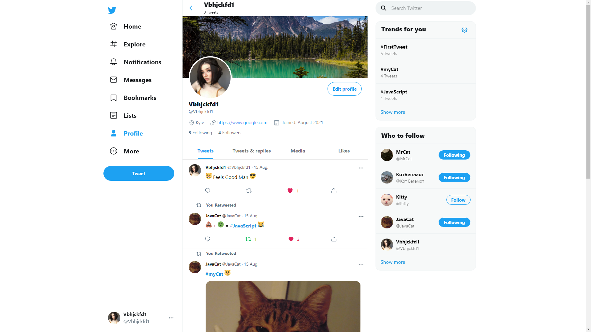
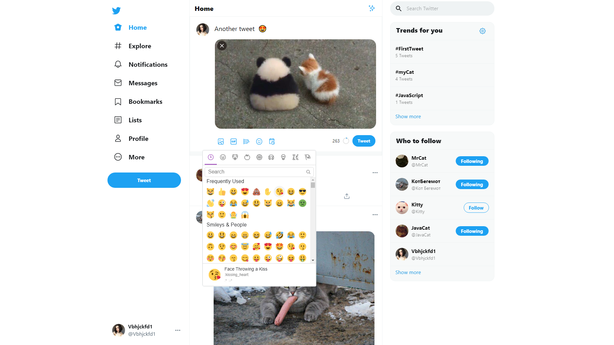
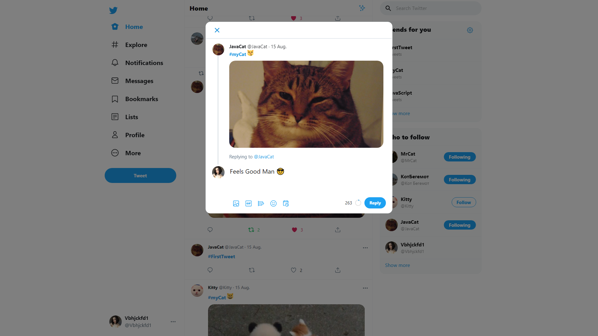
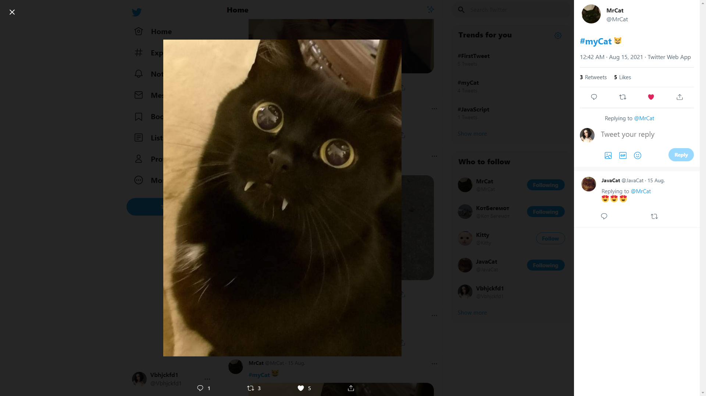
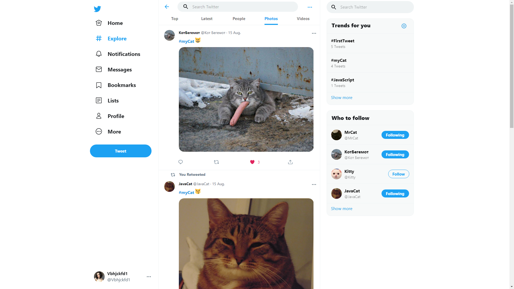
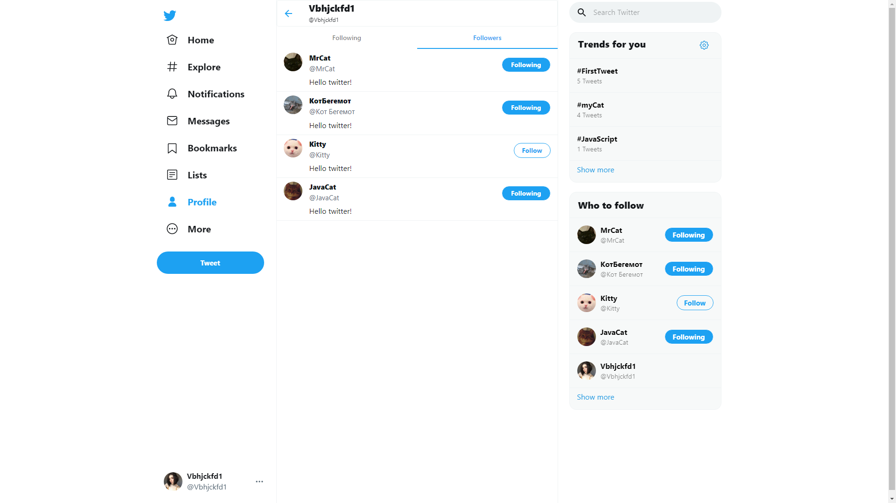
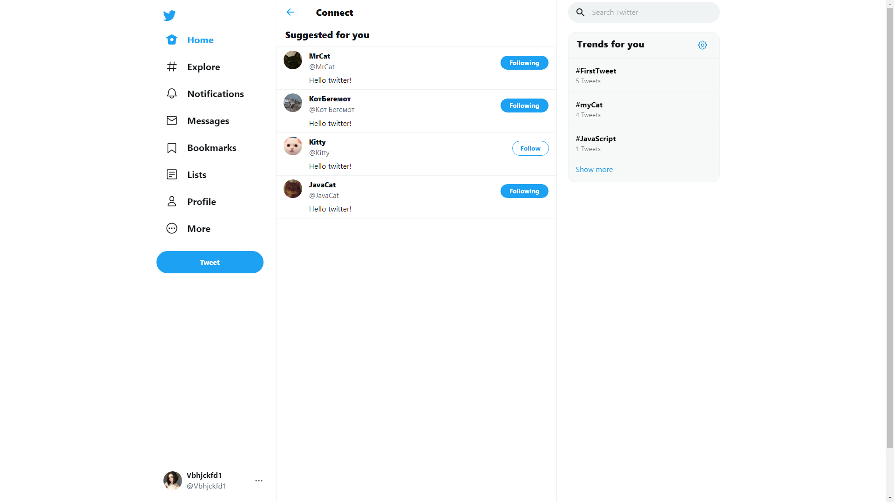
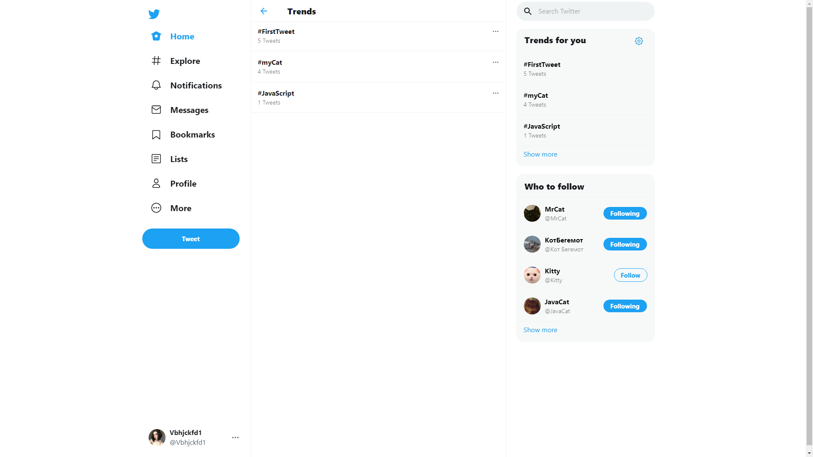
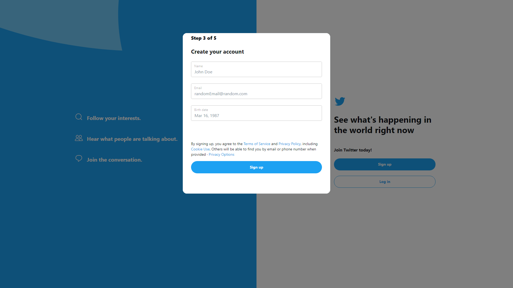
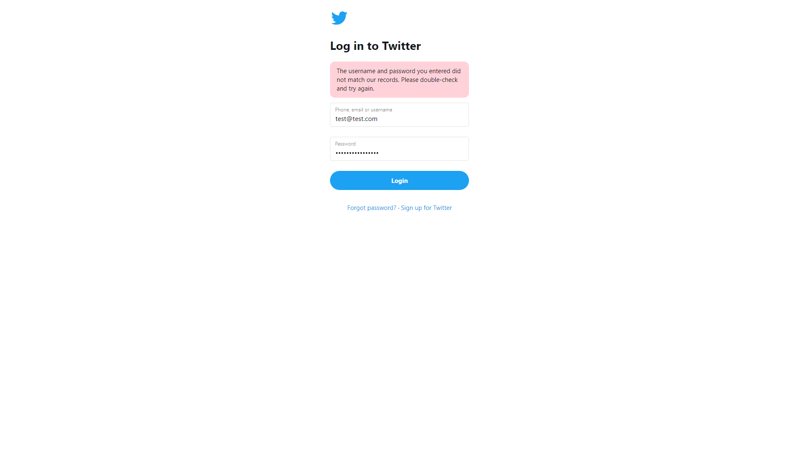

# Twitter clone

Twitter clone developed using Spring Boot and React.js.  
The project is always updated with new features.  
See demo screenshots below.

## Used Technologies:

* Back-end: Spring (Boot, Data, Security), JPA / Hibernate, PostgreSQL, JUnit, Mockito
* Front-end: TypeScript, React.js, Redux-Saga, Material-UI
* Security: JWT
* AWS S3 bucket

## Features

* Authentication with JWT and Email validation.
* Users can add tweets, like tweets, retweet and reply.
* Users can subscribe to each other.
* Users can edit own profile.
* Users can search tweets by hashtags and search other users tweets.
* All images downloads on Amazon S3 bucket

## Next Updates

* Bookmarks
* Lists
* Notifications
* Online chat
* Poll component
* Scheduled tweets
* Advanced search

## Screenshots

#### User page

#### Add tweet

#### Reply tweet

#### Tweet image modal

#### Search

#### Full tweet

#### Liked by modal

#### Following and Followers

#### Connect

#### Trends

#### Registration

#### Login

